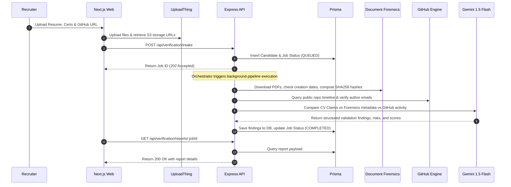

# VeriSphere Architecture & Design System

This document describes the architectural styling, data flow diagrams, and validation pipelines governing VeriSphere.

---

## 🏗️ Architectural Style: Clean Architecture

We separate system concerns into concentric layers to isolate business models from third-party tools, frameworks, and storage drivers.

```
       ┌─────────────────────────────────────────────────────┐
       │                 Presentation Layer                  │
       │     (Next.js App Router Pages, Tailwind Widgets)    │
       └──────────────────────────┬──────────────────────────┘
                                  │
       ┌──────────────────────────▼──────────────────────────┐
       │                Infrastructure Layer                 │
       │    (Express Routers, Prisma client, Clerk Auth)     │
       └──────────────────────────┬──────────────────────────┘
                                  │
       ┌──────────────────────────▼──────────────────────────┐
       │                  Application Layer                  │
       │   (Ingestion Use Cases, Verification Orchestrator)  │
       └──────────────────────────┬──────────────────────────┘
                                  │
       ┌──────────────────────────▼──────────────────────────┐
       │                    Domain Layer                     │
       │   (Verification Entity validation, Custom Errors)   │
       └─────────────────────────────────────────────────────┘
```

### 1. Presentation Layer (`apps/web`)
Consists of interactive pages, state managers, and views. It communicates via JSON payloads with the REST API using security tokens or keys.

### 2. Infrastructure Layer (`apps/api/src/infrastructure`)
Contains Express routers, database adapters (Prisma client), logging middlewares, rate limits, and third-party API configurations (GitHub Octokit client, Gemini SDK).

### 3. Application Layer (`apps/api/src/application`)
Drives verification workflows. The `VerificationOrchestrator` implements execution orchestrations, coordinating file parsers, GitHub collectors, and AI models to run verification pipelines.

### 4. Domain Layer (`apps/api/src/domain`)
Encapsulates entity rules, email validation constraints, security models, and error bounds. It holds zero references to ORMs or Web Frameworks.

---

## 🔄 Verification Data & Event Flow



---

## 🔒 Security Architecture
- **Document Forensics**: PDF parsers validate headers before memory buffering to safeguard against malformed payloads. SHA256 hashes prevent document forgery.
- **Data Protection**: Clear boundaries on PII data. Candidate parameters must be restricted based on Organization ID contexts.
- **Secrets Encryption**: database connections and AI API keys reside in dotenv parameters, never committed. API Keys are stored hashed (SHA256) inside Neon DB.
